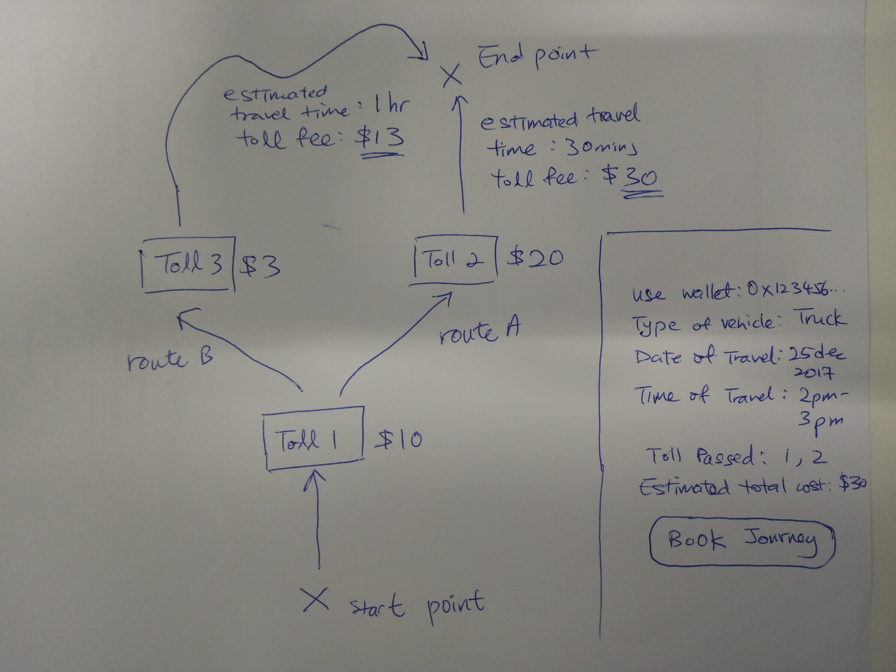

# Blockchain in Toll Roads

## Introduction

Road toll is created to reduce traffic jams. People are less likely to travel on certain roads if they have to pay. There could be complex forumalae to calculate the toll fee such as type of vehicle, day and time of travel, number of passengers...etc. 

Road toll Implementation can be quite varied, from human (manual) tolls to fully automated tolls using technology like [RFID](https://en.wikipedia.org/wiki/Radio-frequency_identification)

Assuming a country uses RFID devices for road toll. The way it works is:

* All vehicles will have a RFID device installed when the vehicle is first purchased. The RFID ID is linked to a carplate in the regulator central database.

* Driver tops up a cash card and inserts the card into the device when driving.

* When the vehicle passes the toll, the card value is automatically deducted based on some business rules decided by the regulator.

* If the card does not have enough credit when passing the toll, the vehicle owner will be penalised.

## Problem:

* Driver is usually not aware of actual toll charges as regulation keeps changing.

* Topping up cash card can be troublesome.

* Cash card can be misplaced or stolen.

* Driver does not know if toll is charging correctly. Driver has to trust the regulator as there is currently no way for the driver to access his own toll ledger.

* Traffic is equally bad most of the time as the toll fee is too low and not responsive to traffic conditions. Regulator could have made the fees higher for everyone but it gets political.

## Possible Solution:

* A permissionless blockchain to track all transactions for all vehicles passing through the toll.

* Driver deposit credit against the vehicle's RFID id inside a smart contract. Once the vehicle passes through the toll, vehicle's credit amount is automatically debited inside the contract. It works very much like the cash card but without the card and cannot be stolen.

* The smart contract allows user to check any toll fee at any point in time.

* The fee is responsive to traffic conditions based on the number of vehicles between 2 toll points every minute, ie fees will be higher when there is a traffic jam and lower when traffic is low.

* The smart contract allows user to pre-book a journey early. Driver pay a small fee and lock in the date/time of travel to get better toll rates. Please refer to the diagram below.

* It is possible to integrate the blockchain into a GPS device. This will provide a good UI for driver to calculate the the toll charges for the journey as well. 

* Having a **Smart Toll System** as mentioned above is very computational demanding and expensive using traditional centralised system.

## Implementation

* Sam is the owner of a truck (rfid: SATOSHI).

* Sam wants to use his blockchain wallet address 0x123 for all his payments.

* The regulator registers the 0x12345 to be the rightly owner of vehicle rfid "SATOSHI" in the smart contract.

* Sam tops up his vehicle balance in the contract.

* Sam starts driving 